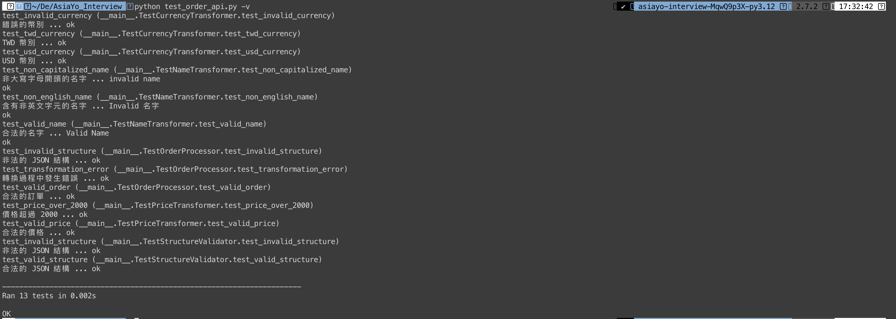

# AsiaYo Homework

## 資料庫測驗

### 題目一

```sql
SELECT
    bnbs.id AS bnb_id,               -- 旅宿 ID
    bnbs.name AS bnb_name,           -- 旅宿名稱
    SUM(orders.amount) AS may_amount -- 5 月總金額
FROM
    bnbs
    JOIN orders ON bnbs.id = orders.bnb_id
WHERE
    orders.currency = 'TWD'
    AND orders.created_at >= '2023-05-01 00:00:00'
    AND orders.created_at <= '2023-05-31 23:59:59'
GROUP BY
    bnbs.id, bnbs.name
ORDER BY
    may_amount DESC
LIMIT 10;
```

### 題目二

1. EXPLAIN 效能分析：
    
    - 使用 `EXPLAIN` 來分析查詢，以及是否存在全表掃描等效能問題。

2. 新增索引：

    - 基於分析結果，檢查相關表是否有合適的索引。例如：

        - orders 表的 `bnb_id`, `currency`, `created_at` 欄位。
        - bnbs 表的主鍵 `id`。

    - 確保 `orders.bnb_id` 和 `bnbs.id` 上有索引，以加速 JOIN 聯結。

3. 使用子查詢或臨時表：

    - 若 orders 資料量非常大，可以考慮先篩選出符合條件的訂單，然後再進行 JOIN。

4. 分區表：

    - 若 orders 資料量非常大，可以考慮按月份或年份進行分區，這樣可以減少需要掃描的資料量。

5. 硬體配置優化：

    - 檢查 MySQL 的設定參數，如 `innodb_buffer_pool_size`，確保分配了足夠的記憶體。同時，也可考慮增加 RAM 和使用 SSD，以提升速度。

## API 實作測驗

### 說明

- 實作一個簡單的 API，接收一個 JSON 格式的訂單資料，並進行驗證。

- 使用 Python Flask 框架實作，並使用 Docker Compose 來建立環境。

- 單元測試：使用 Python unittest 撰寫單元測試，確保程式碼的正確性。

- 額外功能：

    - 使用設定檔 `config.py` 來設定環境變數。

    - 使用 `logging` 模組來記錄程式執行過程。

    - 針對負數價格進行驗證。

    - 針對幣別及其輔幣進行驗證，例如：
    
        - TWD (台幣)：不包含小數點。
        - USD (美元)：包含小數點，且小數點後最多 2 位。

### 使用說明

- Docker Compose

    ```bash
    docker-compose up -d
    ```

- Python

    1. 安裝 Python 3.12 版本
    2. 安裝相依套件

        ```bash
        pip install -r requirements.txt
        ```

    3. 在專案目錄下執行

        ```bash
        flask run
        ```

### SOLID 與設計模式

#### SOLID 原則應用

1. 單一職責原則 (Single Responsibility Principle)
   - 每個類別（如 `StructureValidator`, `NameTransformer` 等）都有單一的職責。
   - `OrderProcessor` 類別負責協調整個處理流程，而不直接處理驗證或轉換。

2. 開放封閉原則 (Open/Closed Principle)
   - 通過使用抽象類別 `OrderValidator` 和 `OrderTransformer`，使得更容易增加新的驗證器和轉換器，而不需要修改現有程式。

3. 里氏替換原則 (Liskov Substitution Principle)
   - 所有的驗證器和轉換器都可以互相替換，因為它們實現了共同的接口。

4. 接口隔離原則 (Interface Segregation Principle)
   - 定義精簡的接口（如 `OrderValidator` 和 `OrderTransformer`），只包含一個方法。

5. 依賴反轉原則 (Dependency Inversion Principle)
   - `OrderProcessor` 依賴於抽象的 OrderValidator 和 OrderTransformer，而不是具體實現。

#### 設計模式應用

1. 策略模式 (Strategy Pattern)
   - 使用不同的驗證器和轉換器作為策略，可以靈活改變 `OrderProcessor` 的行為。

2. 組合模式 (Composite Pattern)
   - `OrderProcessor` 使用一個驗證器和多個轉換器，形成了一個組合。

3. 工廠方法模式 (Factory Method Pattern)
   - 雖然在當前程式中沒有明確使用，但可以簡單新增一個工廠來建立不同的驗證器和轉換器。

4. 單例模式 (Singleton Pattern)
   - Flask 應用本身就是一個單例。

### 單元測試

```bash
python unittest.py -v
```



| Test Case | Description | Result |
| --- | --- | --- |
| [Structure]test_valid_structure | 合法的 JSON 結構 | ok |
| [Structure]test_invalid_structure | 非法的 JSON 結構 | ok |
| [Name]test_non_capitalized_name | 非大寫字母開頭的名字 | ok |
| [Name]test_non_english_name | 含有非英文字元的名字 | ok |
| [Name]test_valid_name | 合法的名字 | ok |
| [Price]test_valid_price | 合法的價格 | ok |
| [Price]test_price_over_2000 | 價格超過 2000 | ok |
| [Price]test_price_negative | 負數價格 | ok |
| [Price]test_price_decimal_places | 測試不同貨幣的價格小數位數 | ok |
| [Currency]test_invalid_currency | 錯誤的幣別 | ok |
| [Currency]test_twd_currency | TWD 幣別 | ok |
| [Currency]test_usd_currency | USD 幣別 | ok |
| [Order]test_valid_order | 合法的訂單 | ok |
| [Order]test_invalid_structure | 非法的 JSON 結構 | ok |
| [Order]test_transformation_error | 轉換過程中發生錯誤 | ok |